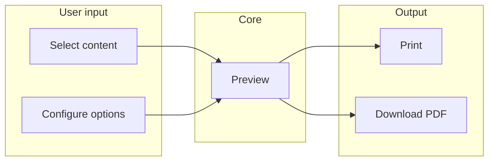

# PRD: Thai Script Writing Practice App (MVP)

> Historical planning document. This PRD captures the original MVP target, not the exact current implementation. For the shipped behavior in this repository, see [CURRENT_STATE.md](./CURRENT_STATE.md).

## 1. Product overview

**Name (working):** Thai Script Pro (or TBD).

**Goal:** Enable users to practice writing Thai script through customizable, printable or digital practice materials. The app is inspired by tools like the reference (consonant selection, sheet options, preview, PDF) but is defined by its own scope and UX choices.

**Primary platform:** Web app, with mobile-friendly / responsive design so it works on phones and tablets as well as desktop.

---

## 2. Target users (assumptions to validate)

- **Self-learners** of Thai who want structured writing practice.
- **Teachers / parents** who need worksheets for students (optional user segment).
- **Devices:** Desktop for creating and printing; mobile/tablet for on-the-go practice or review.

---

## 3. MVP scope

| Outcome                | Description                                                                                 |
| ---------------------- | ------------------------------------------------------------------------------------------- |
| **Select content**     | User chooses which Thai consonants (44) and vowels to practice.                             |
| **Configure practice** | User adjusts rows per character, ghost copies, paper size, grid guide, font, and font size. |
| **Preview**            | User sees a live preview of the generated sheet before committing.                          |
| **Get output**         | User can print or download the sheet as PDF.                                                |

---

## 4. Functional requirements (MVP)

### 4.1 Content selection

- Support **Thai consonants** (44) and **Thai vowels** as selectable units. (Exact vowel set to be defined during implementation; typically ~32 vowels.)
- User can select from consonants and from vowels (e.g., separate "Select Consonants" and "Select Vowels" areas, or a single combined selector with categories).
- Each item has: character(s), and optionally transliteration/name (e.g., ก ไก่ for consonants).
- Selection state visible (e.g., "X consonants, Y vowels selected" or combined count).
- Actions: **Select all** and **Clear** (per category or global, as chosen in implementation).
- Tone marks and words remain out of scope for MVP.

### 4.2 Sheet / practice configuration

- **Rows per character:** control how many practice rows per selected character—consonant or vowel (e.g., 2 rows).
- **Ghost copies per row:** number of faint traceable outlines per row (e.g., 3 copies).
- **Paper size:** at least A4; optional Letter.
- **Grid guide:** dropdown with exactly three options (per reference UI):
  - **Cross (horizontal + vertical)**
  - **Sandwich (top & bottom)**
  - **Thai (3 lines)**
- **Font:** dropdown with the following options; **default: Noto Serif Thai**.
  - Noto Sans Thai
  - Noto Sans Thai Looped
  - Noto Serif Thai *(default)*
  - Mali
  - Playpen Sans Thai
- **Font size:** dropdown for character size on the practice sheet. Provide a small set of sensible options (e.g., Small / Medium / Large, or specific point sizes such as 18pt, 24pt, 32pt) so the sheet is readable when printed.

### 4.3 Preview

- **Live preview** that updates when selection or options change.
- Preview reflects: selected consonants and vowels, rows, ghost copies, grid guide, font, font size, and paper size.

### 4.4 Output

- **Print** and **Download PDF** are both required for MVP (no in-browser digital tracing).
- Output must match preview (same content and layout).

### 4.5 Responsive / mobile-friendly

- Usable on **desktop, tablet, and phone** (readable, tappable, no horizontal scroll for main flows).
- Touch-friendly targets for selection and buttons.
- Preview and output (e.g., PDF) remain correct on small screens (preview may be scaled or scrollable).

---

## 5. Non-functional requirements

- **Performance:** Preview and PDF generation should feel responsive (target: < 2s for typical sheet).
- **Browsers:** Current Chrome, Firefox, Safari, Edge (and mobile variants).
- **Accessibility:** Keyboard navigation for main actions; sufficient color contrast; avoid character size below ~16px for UI text.
- **i18n:** UI in English; Thai script in content only is acceptable for MVP. Optional: Thai UI or locale switcher later.

---

## 6. Out of scope for MVP

- User accounts, login, or persistence of preferences (can use local storage only if needed).
- Digital tracing on screen (e.g., canvas/SVG drawing); focus is printable/downloadable output only.
- Spaced repetition, progress tracking, or gamification.
- Backend or database (static or client-only MVP is acceptable).

---

## 7. MVP decisions (locked)

1. **Content breadth:** Consonants (44) and vowels (full Thai vowel set; exact count TBD at implementation).
2. **Output:** Print + PDF only (no in-browser digital tracing).
3. **Layout and UX:** Single-page layout (all sections—consonant and vowel selection, sheet options, preview, and actions—on one scrollable page).
4. **Font:** Options are Noto Sans Thai, Noto Sans Thai Looped, Noto Serif Thai **(default)**, Mali, Playpen Sans Thai.
5. **Font size:** A dropdown for font size with a few sensible options (e.g., Small / Medium / Large, or 18pt / 24pt / 32pt); exact options to be chosen during implementation.
6. **Grid guide:** Three options only (per reference screenshot): **Cross (horizontal + vertical)**, **Sandwich (top & bottom)**, **Thai (3 lines)**.

---

## 8. Tech stack

- **Runtime / framework:** React (latest stable).
- **Build:** Vite.
- **Package manager:** PNPM.
- **Styling:** TailwindCSS.
- **Components:** Shadcn with Base UI.
- **Testing:** Vitest (unit and component tests) with React Testing Library and user-event, Playwright (e2e tests). Vitest + RTL is used for fast feedback during TDD; Playwright for full user-flow validation. See §9.1 for component-testing approach.

*(If you need to specify versions, PDF library, or how Shadcn and Base UI are combined, add those details here.)*

---

## 9. Development approach

- The project is built using **Test-Driven Development (TDD)**.
- **Unit/component level:** Write Vitest tests first (red), then implement the behavior (green), then refactor. Apply this for logic, hooks, and React components as appropriate.
- **E2E level:** Write Playwright tests for critical user flows (select content, change options, preview, print/PDF) before or in parallel with implementing the UI; use them as living specifications and regression guards.
- Tests are part of the definition of done for each feature; PRs should include or update tests as needed.

### 9.1 Component testing (React Testing Library)

Component tests use **Vitest** as the runner with **@testing-library/react** and **@testing-library/user-event**. They assert **behavior and UX** (what the user sees, clicks, and types, and how the UI updates), not implementation details. Playwright remains the place for full user flows; RTL covers one screen or component in isolation.

| PRD area | What to component-test with RTL |
|----------|---------------------------------|
| **4.1 Content selection** | Selecting/deselecting consonants and vowels; "Select all" and "Clear"; selection count or summary text updates. |
| **4.2 Sheet configuration** | Changing rows per character, ghost copies, paper size, grid guide, font, and font size; correct options in dropdowns and that changes update state or callbacks. |
| **4.3 Preview** | Preview section receives the right props/state and re-renders when selection or options change (no need to assert pixel-perfect layout). |
| **4.4 Output** | "Print" and "Download PDF" buttons are present and invoke the correct handlers (mock `window.print` and PDF generation). |
| **4.5 Responsive** | Optional: render at different viewport widths and assert key controls remain present and usable (e.g. no horizontal scroll for main flows). |

**Boundaries:** Use RTL for one section or component at a time; mock print and PDF generation. Use Playwright for full-page, real-browser flows (select → configure → preview → print/PDF). Avoid duplicating full-flow coverage in both layers.

**Practices:**

- Prefer **queries** that reflect user and assistive-tech usage: `getByRole`, `getByLabelText`, `getByText`.
- Use **userEvent** (e.g. `userEvent.click`, `userEvent.selectOptions`) for interactions.
- Use **async helpers** (`findBy*`, `waitFor`) only when the UI updates asynchronously.
- Treat **Shadcn/Base UI** as implementation details; assert on labels, roles, and visible text/options.
- For **Thai script**, assert that the intended consonants/vowels (or labels) appear in selection and preview; use the same constants as the app to avoid encoding issues.
- Add **accessibility** checks: keyboard navigation for main actions, focusable controls; optionally run `axe-core` in Vitest for automated a11y checks.

**Test file layout:** One test file per major section or top-level component (e.g. `ContentSelection.test.tsx`, `SheetOptions.test.tsx`, `Preview.test.tsx`, `OutputActions.test.tsx`), or colocate next to the component.

**TDD loop:** Red — write an RTL test (e.g. "when user clicks Select all consonants, summary shows 44 consonants"); Green — implement until the test passes; Refactor — then run the full Vitest and Playwright suites.

---

## 10. Success criteria (MVP)

- A user can select Thai content, set sheet options, see a matching preview, and get a printable or downloadable result.
- The app works on desktop and on at least one mobile viewport without breaking flows.
- PDF (if offered) renders correct Thai glyphs and layout for the chosen options.
- Critical user flows are covered by Playwright e2e tests and key logic by Vitest tests.

---

## 11. Next steps after PRD approval

1. Document MVP spec or ticket list (Section 7 decisions are locked).
2. Define single-page sitemap and key sections (consonant and vowel selection, sheet options, preview, actions).
3. Bootstrap project with chosen stack (Section 8): Vite + React + PNPM, TailwindCSS, Shadcn + Base UI, Vitest, Playwright; add PDF library as needed.
4. Create repo structure, component outline, and first implementation tasks (consonant + vowel data, selection UI, options form, preview, print/PDF).

---

## 12. Optional: diagram of MVP flow

